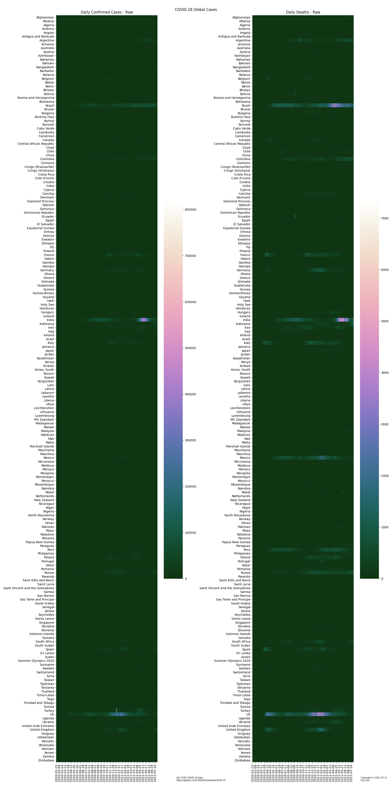
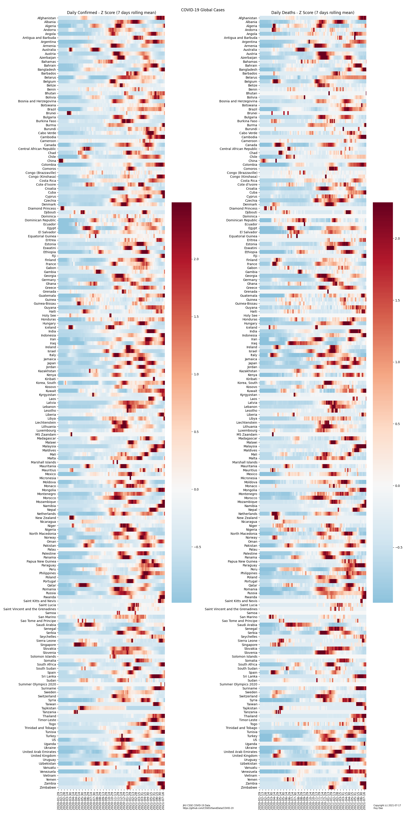
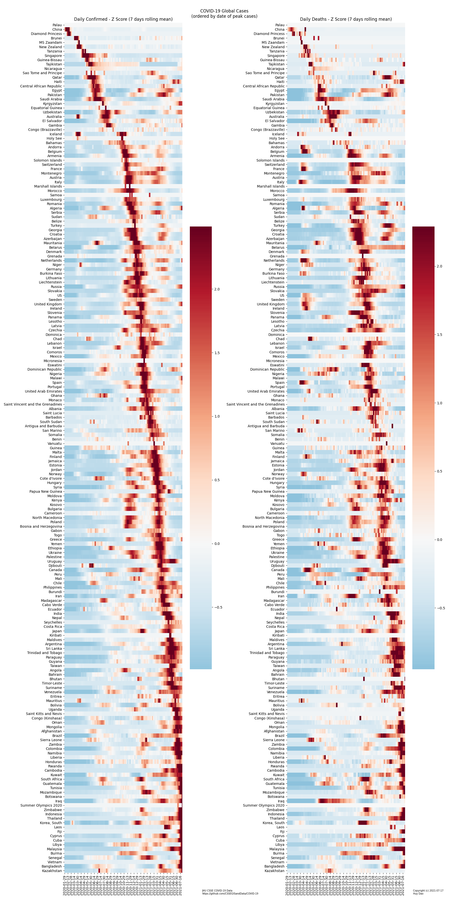
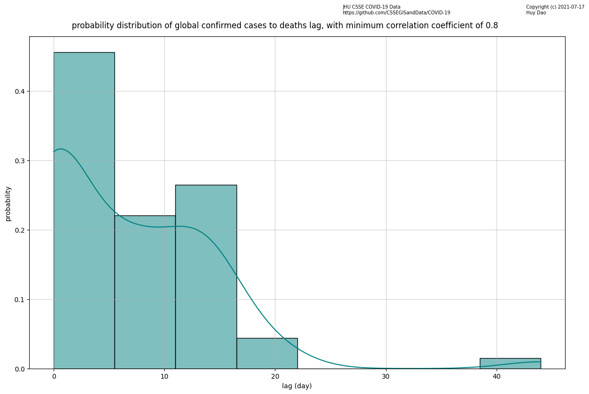

# Covid-19 time series analysis

## Description
Johns Hopkins University Center for Systems Science and Engineering (CSSE) provides a daily update of COVID-19 data time series for both confirmed cases and confirmed deaths on GitHub.  The data is aggregated by JHU CSSE from many sources both international and domestics.
  
The CSSE tries their best to vet the data, however there still may exist discrepancies due to the reporting entity (country, state, province).  The raw data is provided [here](https://github.com/CSSEGISandData/COVID-19) in csv format.  For this particular analysis, Time Series data is provided in this [directory](https://github.com/CSSEGISandData/COVID-19/tree/master/csse_covid_19_data/csse_covid_19_time_series)

## Global data
The global time series has the following columns: `Province/State`, `Country/Region`, `Lat`, `Long`, `date` columns starting from January 22nd of 2020 up to the latest date.
Each row corresponds to either a country/region or province/state (if data is available and provided at this level).  
  
One thing of note is the cases or deaths numbers are cummulative and tallied up after each day.

## Objectives
- To see how each country performs relative to each other in terms of confirmed cases and confirmed death cases
- To see which countries are out of the woods (ie. virus cases contained)
- To see if there is a correlation between the confirmed cases and death cases and if there is a lag and if so what the lag is.  Logically, there should be a lag since people would be infected by the virus before they die
- To see if there is a correlation and a lag between the confirmed cases of different countries

## Obtaining and cleaning data
The time series data can be obtained manually from the url mentioned in the `Description` section.  However, it can also be programmatically obtained by clicking the `Raw` button on GitHub which reveals the raw URL's to download from. 
  
They are: [confirmed cases raw url](https://raw.githubusercontent.com/CSSEGISandData/COVID-19/master/csse_covid_19_data/csse_covid_19_time_series/time_series_covid19_confirmed_global.csv) and [confirmed death cases raw url](https://raw.githubusercontent.com/CSSEGISandData/COVID-19/master/csse_covid_19_data/csse_covid_19_time_series/time_series_covid19_deaths_global.csv).

### Read
Pandas' `read_table()` function can directly read from these URL's since they are just simple CSV's served over HTTP.  Note that the time series use American date format so we need to set `dayfirst=False` when reading the CSV's.
```python
cv_confirmed = pd.read_table(url_confirmed, sep=',', dayfirst=False)
```

### Rename
Next for easy calling of the columns, the following columns will need to be renamed.
```python
cv_confirmed.rename({'Province/State':'Province_State','Country/Region':'Country_Region'}, axis=1, inplace=True)
````

### Groupby
For our purposes, we only need the `Country_Region` level of data.
```python
cv_confirmed = cv_confirmed.groupby('Country_Region').sum()
cv_confirmed = cv_confirmed.iloc[:,2:]
```

### datetime
The dates were reported as UTC and we also need to convert the column data types to Pandas' datetime format for easy processing later.
```python
cv_confirmed.columns = pd.to_datetime(cv_confirmed.columns, utc=True, dayfirst=False)
```

### Filter (Optional)
This is about it as far cleaning the raw data is concerned.
Additionally, if we are only interested in a few countries, we can filter them as followed.  If not, we can comment the below 2 lines out.
```python
countries = re.compile(r'(^us$|brazil|china|india|japan|vietnam|korea|russia|sweden|france|zealand|switzerland|german|united king|iran|saudi|turkey|ireland|singapore|taiwan|australia|spain|italy|canada|mexico)',re.I)
cv_confirmed = cv_confirmed.filter(regex=countries, axis=0)
```

## Analysis
### Diff
As mentioned in the `Global Data` section, the provided data is cummulative and since we are interested in day to day change so:
```python
cv_confirmed_diff = cv_confirmed.diff(1, axis=1).dropna(axis=1)
```

In some cases, due to data discrepancies (or for political reasons) of the reporting entity/country, there maybe a negative difference.
Which would not make sense, since you cannot have say 10000 overall cummulative cases on today and then just 9000 overall cummulative cases on the next.
People cannot just un-have covid or dead people cannot just come back to life.  If the test data was erroneous, it should have been changed retro-actively. 
  
The following line is to clean up such scenario and assigns a value of 0 to those cells.  
JHU CSSE does go through these historical data and make changes as they obtain better or more accurate historical data, so the below changes only affect a very few number of cells.
In fact, since overall there is so much data available that when plotted out, visually there is no difference whether the below adjustment is made or not.
```python
cv_confirmed_diff = cv_confirmed_diff.stack().mask(cv_confirmed_diff.stack() < 0, 0).unstack()
```

### Raw data heatmap
First, let's do a heatmap of the raw data to see where things stand.
The following is the heatmap with some niceties (title, axis labels, legend, etc.) added on top of it.


Three observations can be made from the raw data heatmap:
1. Some countries have so much confirmed cases and confirmed deaths that they completely overshadow the other countries on the color scale.
Particularly, the US, India, and Brazil completely outnumber many other countries in terms of cases and deaths.

2. There is a jagged pattern of light and dark to the heatmap, this is due to the way the data is collected and reported, with less data reported over the weekend than on weekdays.  As is, it's still usable, however we can smooth it out with a 7 days running average.

3. The number of deaths was much higher at the beginning of the pandemic than it is later on.  Take the case of the US for example, even though it is currently in the 3rd wave, the number of deaths is still much lower than it was during the 1st wave.  This point will be re-visited later when we do the confirmed cases versus deaths correlation.

### Normalize
To address point number 1 above, and for the purpose of our objectives listed in the section above, we are interested to see which countries are out of the woods relative to each other.
We therefore need to normalize the data.  There are 2 ways of doing this:

##### `Min-Max normalization`
This is the case where we simply take each individual data point and simply dividing by the maximum for each series.  The range will be from 0 to 1.
```python
cv_confirmed_diff_norm = cv_confirmed_diff.apply(lambda x: x/x.max(), axis=1).fillna(0,axis=0)
```  
  
##### `Z score standardization`
This is the case where we normalize the data so that the mean is 0 and standard deviation is 1.  The **`Z score`** is a measure of how many standard deviation away from the mean each individual data point is.  The range can be from negative to positive with the center (mean) tend to be at 0.
```python
zscore = lambda x: (x - np.mean(x))/(np.std(x) + 1e-10)
cv_confirmed_diff_z = cv_confirmed_diff.apply(zscore, raw=True, axis=1).fillna(0,axis=0)
```  
- the reason for the dividing by `standard deviation + 1e-10` is so that we don't get a `NaN` or infinity if the standard deviation is zero
  
### 7 days running mean
To address point number 2 above, it is very easy to apply a 7 days running mean with Pandas.
```python
cv_confirmed_diff_z_roll = cv_confirmed_diff_z.rolling(7, axis=1).mean().dropna(axis=1)
```
Since data at the initial 7 days are not available, they will be dropped.  So the start date of the heatmap will move to 01/29/20 instead of 01/22/20

  
Applying both the `7 days running mean` and the `z-score normalization` mentioned above, we get the following heatmap (plus adjustment to the colormap to make it look nicer).


  
Now the followings are fairly obvious:
- where the peaks cases are for each country
- how many peaks there are for each country (ie. whether they're in the 1st wave, 2nd wave, or 3rd wave)
- whether they have gotten things under control and are completely out of the woods.
  
Additionally, the colormap is set up such that it is diverging, where  `0 standard deviation` is `white` and anything above 0 is `red`, anything below 0 is `blue`.

### Reorder by Date of Peak confirmed cases or deaths
To re-order by date of peak cases or deaths, it's fairly easy in pandas:
```python
cv_confirmed_diff_z_roll_by_max = cv_confirmed_diff_z_roll.idxmax(axis=1).sort_values().index.values
cv_confirmed_diff_z_roll_max = cv_confirmed_diff_z_roll.reindex(cv_confirmed_diff_z_roll_by_max)
```
- First, we find the index of maximum value for each row (across the columns).  Then we sort the index by values, select just the index and returns it to Series `cv_confirmed_diff_z_roll_by_max` 
- Then we reindex the DataFrame by the index Series `cv_confirmed_diff_z_roll_by_max` 
  
The updated heatmap:

  
Now it is fairly obvious which countries are out of the woods (assuming the validity of their provided data). A few observations can be made:
- China is the 1st on the list since it was the reported origin of the virus and it is the 1st country to have gotten under control.  One odd thing is the there is a large spike in death reported in April, suggesting some potential data integrity issue
- Some countries reported confirmed cases but either have 0 confirmed deaths or do not collect and report COVID deaths, such as Laos or Cambodia
- Some countries experienced the worst 1st wave and have gone through a period of lows before entering lower 2nd and 3rd waves.  Example: South Korea or Turkey
- Some countries experienced a mild (relatively) 1st wave and have gone through a period of lows before entering worse/higher 2nd and 3rd waves and still have gotten back into control.  Example: Australia or Vietnam
- Some countries basically just have a slow burn of relatively high cases through a prolong period.  Example: Kuwait, Panama, Guatemala, Brazil, Honduras, Iraq, Mexico
- Many countries have each succesive wave is worse than the last and just haven't gotten out of the woods and back into control yet.  Example: US, Sweden, United Kingdom, Italy, Russia, Greece 
- The same observation as previously made.  For some countries, such as the US, Sweden, Denmark, Japan, the initial death of the 1st wave is much higher than the successive waves

### Confirmed cases versus Confirmed deaths cross-correlation
From reading the heatmap above, we can see that there are cases where there is a correlation between deaths and confirmed cases (as one would expect).  Also one would expect that there is a lag or delay time between death and confirmed cases.  
  
However, in some cases, as mentioned in the previous sections, as time go on, the doctors and health care professionals appeared to have learned much about treatments that the number of deaths aren't as high as the 1st wave and therefore do not correlate with confirmed cases anymore.
  
A quantifiable way of showing this is by performing [Cross-Correlation](https://en.wikipedia.org/wiki/Cross-correlation#Normalization).  This is essentially a sliding dot product of 2 normalized time series. 
It allows one to calculate:
- the correlation coefficient (value ranging from -1 to 1)
- the lag / lead time between the 2 series
  
To do this, we write the following Numpy function and apply it on the already **Z standardized** series:
```python
def corrlag(x, y):
    n = x.shape[0]
    corr = np.correlate(y/n, x, 'full')
    return np.max(corr), (np.argmax(corr) - (n - 1))

# confirmed cases versus death cross-correlation -> the below return DataFrame confirmed_death_corr_lag, which has 2 columns: correlation and lag

confirmed_death_corr_lag = pd.DataFrame([corrlag(cv_confirmed_diff_z.loc[i,:], cv_death_diff_z.loc[i,:]) for i, _ in cv_confirmed_diff_z.iterrows()], columns=['correlation', 'lag'], index=cv_confirmed_diff_z.index)
```
This returns a DataFrame **`confirmed_death_corr_lag`** which has the **`Country_Region`** as its index and has 2 columns: **`correlation`** and **`lag`** time (in days).  Note that the correlation coefficient in our case returns only in the range of 0 to 1, since the data is z standardized and we are taking the maximum.

Below is the plot of confirmed cases and deaths, their maximums, and the lag/lead time cross-correlation.  The `dashed blue line` indicates maximum cases, the `dashed red line` indicates maximum deaths, and the `dotted black line` indicates the cross-correlated death lag time from the date of maximum cases:
  


The reasonable takeaway from the above chart is that in general, if the `correlation coefficient` is high and the `lag` time reasonable (ie. non-negative), then one can use the cross-correlated `lag` time, since it was calculated by taking the variance of both distributions into account.

If the `correlation coefficient` is not high and the `lag` time unreasonable (ie. negative) based on the observations of the 2 distributions (maybe it is because we were cross-correlating uni-modal to multi-modal distributions), one will have to try to find the `lag` time via other means, such as trying to take the time difference of the 2 maximums. Or by observing the graphs to see where there has been a shift in the distributions and segment the cross-correlation calculations based on these timeframes.  

Another method (distilled from the above graphical method) can be to take the 1st derivatives of both Z normalized distributions with respect to time and segment the data into sections using the cut-off points where both distributions' 1st derivatives are close to 0 and their respective Z score are close to 0.
  
In general, it is best to plot both distributions onto the same graph, mark the `peaks` of both distributions, mark the `peak + lag`, note the `cross-correlation` value and `lag` value and compare with `peak to peak` values.  

Keep in mind that a high correlation coefficient does not necessarily mean one distribution leads/lags another, as correlation does not necessarily equals causation.

Some observable scenarios are described below:
  
  
#### If the **`lag`** time is positive
This means the death numbers lag behind cases numbers. Some hypotheses one can make:
1. The country has as many tests available as is needed 
2. The patients/citizens are willing to test as needed
3. The cost of tests and/or treatment is reasonable/affordable

#### If the **`lag`** time is negative
This implies that the death numbers lead the cases numbers.  Logically, this would not make sense since people usually succumb after contracting the virus, not prior to contracting the virus, however there some hypotheses that can provide explanations to this:
1. There were not enough test kits available at the time of virus contraction and there were more tests done postmortem.  Such was the case with the US in March and April of 2020 during the first wave, when the CDC test kits were found to be defective
2. Some severe cases previously reported where people just die shortly after contracting the virus, without having tested prior to death
3. Delay in test results.  People died due to the disease before the test results are made available
4. Another hypothesis is that in some countries where the death numbers in the first peak is extraordinarily high, however as time passes, the health care professionals have since become experts at handling this problem and the death numbers dropped in subsequent cases.  This negative lag (or rather lead) time can also be observed from the above plot. 
5. The country is in the midst of another another wave / transition phase where both the confirmed cases and deaths distributions are changing

  
#### If the **`lag`** time is 0  
The more curious cases are where there is *both* a high **`correlation coefficient`** and **`0 lag time`** as seen in the *some* of the below 20 countries.  These could be the possibilities:
1. There are not as much tests done when people were feeling the symptoms (either due to lack of tests or costs of tests). People die as quick as tests are made avalable, the system is overwhelmed.  Test supply chain issues?
2. COVID denial mentality.  Only tested enmasse postmortem after people die without other attributable apparent cause
3. There maybe some form of data manipulation going on
```python
In [81]: confirmed_death_corr_lag.sort_values(by=['correlation', 'lag']).tail(20)
Out[81]: 
                   correlation  lag
Country_Region                     
Taiwan             0.907796   14
Hungary            0.910870   12
Venezuela          0.911915    0
Bangladesh         0.916409    0
Portugal           0.917640    7
Cuba               0.918944    0
Syria              0.919665    0
Jordan             0.920851    8
Costa Rica         0.922860    0
Uruguay            0.924437    7
Burma              0.924933    0
Azerbaijan         0.925216    8
Morocco            0.929745    6
Afghanistan        0.930203    0
Mongolia           0.930484    0
India              0.932250   13
Thailand           0.935887    0
Colombia           0.943978    0
Indonesia          0.961385    0
MS Zaandam         0.961486    0
```

  
#### Histogram of lag time between confirmed cases to deaths


## TO DO
- [ ] Add discussion about country to country cross-correlation, code is already in place
- [ ] Figure a way to easily illustrate country to country cross-correlation
